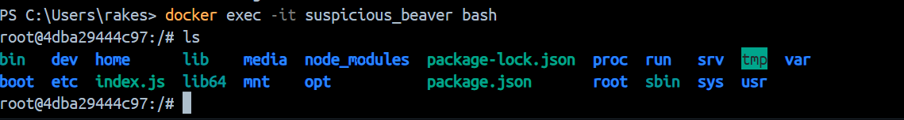

# Step 1: npm init

Just press 'Enter' for everything

# Step 2: npm i express

Install Express

# Step 3: Create a file 'main.js'

Write the contents of main.js

# Step 4: create a file with name 'Dockerfile'

After completion of Dockerfile, we have to create a image and for that...

# Step 5: Build the Dockerfile

```
docker build -t my-node-app .
```

-t = tag name
then we have to give the tag name, in above command, it is `my-node-app` and then we have to give Dockerfile path

Now you should observe that a docker image is created with a name `my-node-app` in docker desktop images

# Step 6: Run the container

```
docker run -it my-node-app
```

We will get that

```
Server is running on PORT: 8000
```

But when we try to get request it shows, 'NOT FOUND'

Here we to do `PORT MAPPINGS` for the container

We have to set `PORT MAPPINGS` at the start of building the container

So now will create a new container with command

```
docker run -it -p 8000:8000 my-node-app
```

Now in your local machine with http://localhost:8000 with container running

We see this as output:

```
{
  "message": "I am Node from Container"
}
```



Here if observe it is `index.js` in the container where in out local machine it is `main.js`

Now our output is appearing in port 8000 which is located in .env locally

For this, stop the running container

We can change the Environmental Variable values with command

```
docker run -it -e PORT=4000 -p 4000:4000 my-node-app
```

Now we be having another container with the image `my-node-app`

and that container starts working on port 4000

Fun Task:
Since there are two containers with ports 8000 and 4000 respectively, Try changing the contents of `message` on index.js in both containers with different texts.
